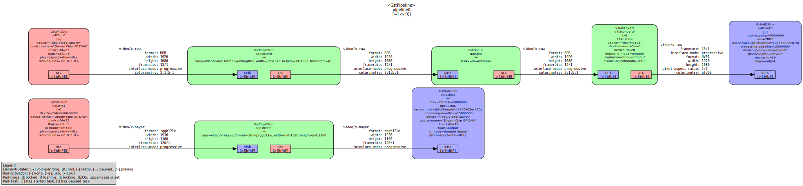

# Camera bringup and example pipelines

This document informs about several steps used during camera bringup.


[TOC]


## V4l2

Capturing images is only possible when booting via NFS and running `mount / -o
remount,rw` afterwards to allow writing files.

Get information from v4l2 device:
```
v4l2-ctl -d /dev/video/vi0 --all
```

Get information from media device:
```
media-ctl -d /dev/media2 -p
```

Stream 1000 frames or capture a single frame:
```
v4l2-ctl --stream-mmap --stream-count=1000 -d /dev/video/vi0
v4l2-ctl --stream-mmap --stream-count=1 -d /dev/video/vi0 --stream-to test.raw
```


## Kernel Logging

To change the global kernel log level set it to `1` in the bootargs (loglevel=1).

Enable kernel timestamps during runtime:
```
echo 1 >/sys/module/printk/parameters/time
```

Enable/change kernel loglevel during runtime (5 = warning, 7 = debug):
```
echo 8  > /proc/sys/kernel/printk
```


## Sysfs debug

For debugging purposes and bringup several sysfs entries are implemented in the drivers:
Adapt the address to hardware you need.
```
cat /sys/devices/platform/26400200.isp_pre/debug_csiinfo
cat /sys/devices/platform/26400200.isp_pre/debug_irqinfo
cat /sys/devices/platform/26400200.isp_pre/clear_irqinfo
cat /sys/devices/platform/27000040.mipi0_dphy_rx/dphy_dump
cat /sys/devices/platform/26000000.isp_main/debug_irqinfo
cat /sys/devices/platform/isp_main_dma@26040000/debug_dma_stats
```


## GStreamer Pipelines

GStreamer is used to create pipelines that test and combine the different modules.

Several pre-configured pipelines were created and tested during bringup. They
are available on the system and are collected in
[`test_video_pipeline.sh`](../repos/meta-zukimo/recipes-apps/user-tools/files/test_video_pipeline.sh).


### GStreamer debugging and performance analysis

To be able to write trace data assure that the partition used to store the
trace log is writable (`mount / -o remount,rw`).

Some helpfull links regarding GStreamer debugging:

- [GstShark](https://developer.ridgerun.com/wiki/index.php/GstShark_-_gstshark-plot)
- [GStreamer Trace](https://gstreamer.freedesktop.org/documentation/additional/design/tracing.html?gi-language=c)
- [GStreamer Debugging Tips](https://developer.ridgerun.com/wiki/index.php/GStreamer_Debugging)


### GStreamer variables for debugging

- `GST_DEBUG_FILE=trace.log` - write trace data to log instead of stdout
- `GST_DEBUG="GST_TRACER:7"` - enable tracer
- `GST_DEBUG=4`              - enable debug level 4
- `GST_TRACERS="graphic"`    - generate a dot graph from the pipeline

See
[gstreamer tracers](https://developer.ridgerun.com/wiki/index.php/GstShark_-_Tracers)
for more info on tracers.


### Generate a graphical view for your pipeline

```
GST_DEBUG_DUMP_DOT_DIR=. gst-launch-1.0 <pipeline>
# For example:
GST_DEBUG_DUMP_DOT_DIR=. ./test_video_pipeline.sh 3
```

Convert the generated dot file on the host:
```
dot -Tsvg <timestamp>-gst-launch.PLAYING_PAUSED.dot -O
```

Example output: 
